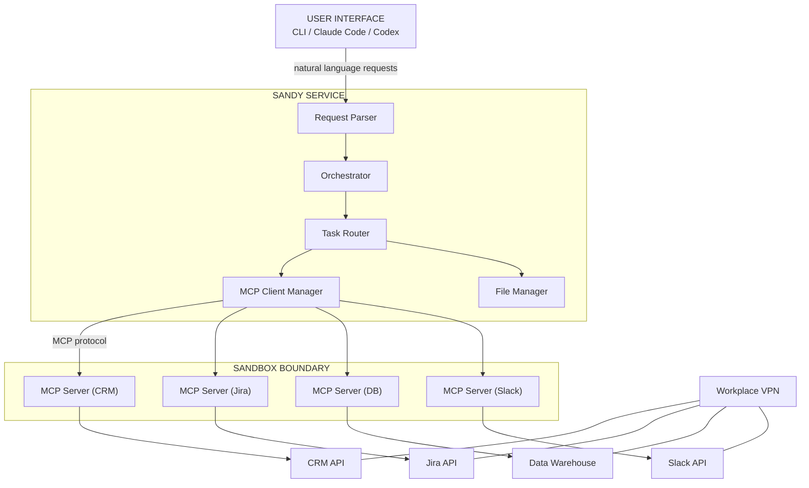

# Sandy — SANdbloxable AI Assistant

## Product Requirements Document

---

### 1. Vision

Sandy is a sandboxable AI assistant that can operate within **any** sandbox environment. It runs as a background service on the user's machine, communicates exclusively through **MCP (Model Context Protocol)** servers, and never violates VPN or sandbox security policies. Sandy gathers information from internal workplace services, prepares reports, and manages files and folders — all within the security boundary defined by the user.

---

### 2. Problem Statement

- Workplaces use VPNs, sandboxes, and firewalls to protect internal services.
- AI assistants (Claude, Codex, etc.) run outside these boundaries and cannot safely access internal data.
- There is no AI assistant that can be deployed **inside** a sandbox, communicate via **standardized MCP servers**, and still deliver meaningful work (reports, file management, data gathering).
- Employees need a way to get AI-powered insights from internal services without compromising security.

---

### 3. Goals

1. **Sandbox-agnostic**: Work within ANY sandbox — Docker, WSL, chroot, systemd-nspawn, Firejail, Kubernetes pods, or custom.
2. **MCP-only communication**: All interaction with external services happens through MCP servers. No raw HTTP/gRPC/SSH unless mediated by an MCP server.
3. **VPN-safe**: Never bypass, tunnel around, or violate VPN routing or security rules.
4. **Dual deployment**: Run as a standalone service (with bundled LLM) or as a plugin within Claude Code / Codex.
5. **File management**: Create, edit, delete files and folders within the sandbox.
6. **Report generation**: Gather information from multiple MCP-connected services and produce structured reports.

---

### 4. Non-Goals

- Building a new LLM model.
- Replacing Claude Code, Codex, or other AI coding tools.
- General-purpose IT automation (Sandy is AI-assisted, not a cron job runner).
- Supporting direct database connections or non-MCP protocol communication.

---

### 5. Core Requirements

#### 5.1 — Sandboxing

| ID | Requirement | Priority |
|----|-------------|----------|
| SB-01 | Sandy must run inside a user-defined sandbox with configurable constraints (network, filesystem, processes). | P0 |
| SB-02 | Sandbox configuration must be declarative — a single file that defines what is allowed and what is not. | P0 |
| SB-03 | Sandy must detect its sandbox boundary at startup and refuse operations that would escape it. | P0 |
| SB-04 | Sandy must support at least: Docker containers, WSL, and Firejail at launch. | P1 |

#### 5.2 — MCP Server Communication

| ID | Requirement | Priority |
|----|-------------|----------|
| MCP-01 | All communication with workplace services must go through MCP servers. No direct protocol calls. | P0 |
| MCP-02 | Sandy must load MCP server configurations from a manifest file at startup. | P0 |
| MCP-03 | Sandy must validate MCP server availability and capabilities at startup. | P0 |
| MCP-04 | Sandy must support connecting to multiple MCP servers simultaneously. | P0 |
| MCP-05 | Sandy must handle MCP server authentication (OAuth, API keys, mutual TLS). | P0 |
| MCP-06 | Sandy must retry failed MCP requests with configurable backoff. | P1 |
| MCP-07 | Sandy must log all MCP server calls for auditability. | P1 |

#### 5.3 — VPN & Network Safety

| ID | Requirement | Priority |
|----|-------------|----------|
| VPN-01 | Sandy must never route traffic outside VPN-sanctioned paths. | P0 |
| VPN-02 | Network egress must be restricted to endpoints declared in the sandbox config. | P0 |
| VPN-03 | Sandy must detect if VPN connectivity is lost and pause operations. | P1 |

#### 5.4 — File & Folder Operations

| ID | Requirement | Priority |
|----|-------------|----------|
| FM-01 | Sandy must create, read, update, and delete files within the sandbox. | P0 |
| FM-02 | Sandy must create, rename, and delete directories within the sandbox. | P0 |
| FM-03 | File operations must be restricted to allowed paths defined in the sandbox config. | P0 |
| FM-04 | Sandy must support file operations across multiple formats (plain text, CSV, JSON, Markdown). | P1 |

#### 5.5 — Report Generation

| ID | Requirement | Priority |
|----|-------------|----------|
| RG-01 | Sandy must query multiple MCP servers to gather information relevant to a user's request. | P0 |
| RG-02 | Sandy must synthesize gathered information into structured reports (Markdown, PDF, JSON). | P0 |
| RG-03 | Sandy must save generated reports to a user-specified directory within the sandbox. | P0 |
| RG-04 | Reports must include a "sources" section listing which MCP servers contributed data. | P1 |

#### 5.6 — Deployment Modes

**Mode A: Standalone Service**

| ID | Requirement | Priority |
|----|-------------|----------|
| SD-01 | Sandy runs as a long-lived background service on the host machine. | P0 |
| SD-02 | Sandy bundles a lightweight LLM model (e.g., Llama 3.1 8B, or smaller) for offline-capable reasoning. | P0 |
| SD-03 | Sandy exposes a local API (REST or CLI) for the user to send requests. | P0 |
| SD-04 | The bundled LLM is swappable — user can configure a different model or remote endpoint. | P1 |

**Mode B: Plugin (Claude Code / Codex)**

| ID | Requirement | Priority |
|----|-------------|----------|
| PL-01 | Sandy installs as a plugin within Claude Code and GitHub Codex. | P0 |
| PL-02 | The plugin registers Sandy's capabilities with the host tool. | P0 |
| PL-03 | The host LLM handles high-level reasoning; Sandy handles sandboxed execution, MCP communication, and file operations. | P0 |
| PL-04 | Plugin name is **"Sandy"**. | P0 |

---

### 6. Architecture



#### 6.1 — Components

| Component | Responsibility |
|-----------|----------------|
| **Request Parser** | Parses natural language input into structured task definitions. |
| **Orchestrator** | Coordinates multi-step workflows across MCP servers and file operations. |
| **Task Router** | Routes individual tasks to the appropriate handler (MCP or File Manager). |
| **MCP Client Manager** | Manages connections to all registered MCP servers, handles auth, retries, and lifecycle. |
| **File Manager** | Handles CRUD operations on files and directories within the sandbox. |
| **LLM Engine** | Reasoning layer — either the bundled local model or the host LLM (plugin mode). |
| **Sandbox Enforcer** | Validates that all operations stay within declared sandbox boundaries. |

---

### 7. Configuration Files

#### `sandy.json` — Main Config

```json
{
  "mode": "standalone",
  "llm": {
    "provider": "local",
    "model": "llama-3.1-8b-instruct",
    "api_key": null
  },
  "sandbox": {
    "runtime": "firejail",
    "allowed_paths": ["/home/user/sandy-workspace"],
    "allowed_network": ["internal.company.com:443"],
    "max_memory_mb": 2048,
    "max_cpu_percent": 50
  },
  "mcp_servers": "./mcp-servers.json",
  "report_output_dir": "./reports"
}
```

#### `mcp-servers.json` — MCP Server Manifest

```json
{
  "servers": [
    {
      "name": "crm",
      "transport": "stdio",
      "command": ["npx", "-y", "@company/crm-mcp-server"],
      "env": { "CRM_API_KEY": "${CRM_API_KEY}" },
      "capabilities": ["read_deals", "read_contacts"]
    },
    {
      "name": "jira",
      "transport": "sse",
      "url": "https://internal.company.com/jira-mcp",
      "auth": {
        "type": "bearer",
        "token": "${JIRA_TOKEN}"
      },
      "capabilities": ["read_sprints", "read_issues", "create_issue"]
    }
  ]
}
```

---

### 8. Security Model

| Principle | Implementation |
|-----------|----------------|
| **Least privilege** | Sandy only accesses explicitly configured paths, network endpoints, and MCP servers. |
| **No escape** | Sandbox enforcer validates every operation against boundary rules. |
| **Credential safety** | Secrets are injected via environment variables or a secrets manager — never stored in config files. |
| **Audit trail** | Every MCP call, file operation, and LLM interaction is logged to an append-only audit log. |
| **VPN enforcement** | Network calls are restricted to allowlisted endpoints. Egress outside the VPN is blocked by the sandbox. |

---

### 9. Open Questions

1. **Which sandbox runtime(s) to prioritize?** Docker is the most portable, but Firejail and WSL cover different user segments.
2. **Standalone LLM size vs. quality tradeoff.** A sub-8B model is fast but may struggle with complex report synthesis. Should we offer tiered models?
3. **MCP server authoring.** Should Sandy include tooling for users to write their own MCP server wrappers for internal services?
4. **Real-time updates.** Should Sandy support streaming responses for long-running queries?
5. **Multi-user support.** Should a single Sandy instance serve multiple users, or is one-instance-per-user the model?
6. **Plugin distribution.** How do we distribute the Claude Code / Codex plugin? Marketplace, npm, manual install?

---

### 10. Phase 1 Scope

**Build the MVP as a Claude Code / Codex plugin first.**

- Implement the MCP Client Manager and File Manager.
- Build the Orchestrator to handle multi-step tasks across MCP servers.
- Create the plugin interface for Claude Code and Codex.
- Support 2-3 MCP servers out of the box (e.g., file system, web search, one internal service).
- Generate reports in Markdown format.
- Full sandbox enforcement with configurable boundaries.

**Defer standalone mode** (bundled LLM) to Phase 2 once the plugin is stable.

---

### 11. Success Metrics

| Metric | Target |
|--------|--------|
| Sandboxes supported at launch | 2 (Docker + Firejail or WSL) |
| MCP servers supported | 5+ |
| Report generation latency (simple query) | < 30 seconds |
| Sandbox escape attempts detected & blocked | 100% |
| Plugin compatibility | Claude Code + Codex |
