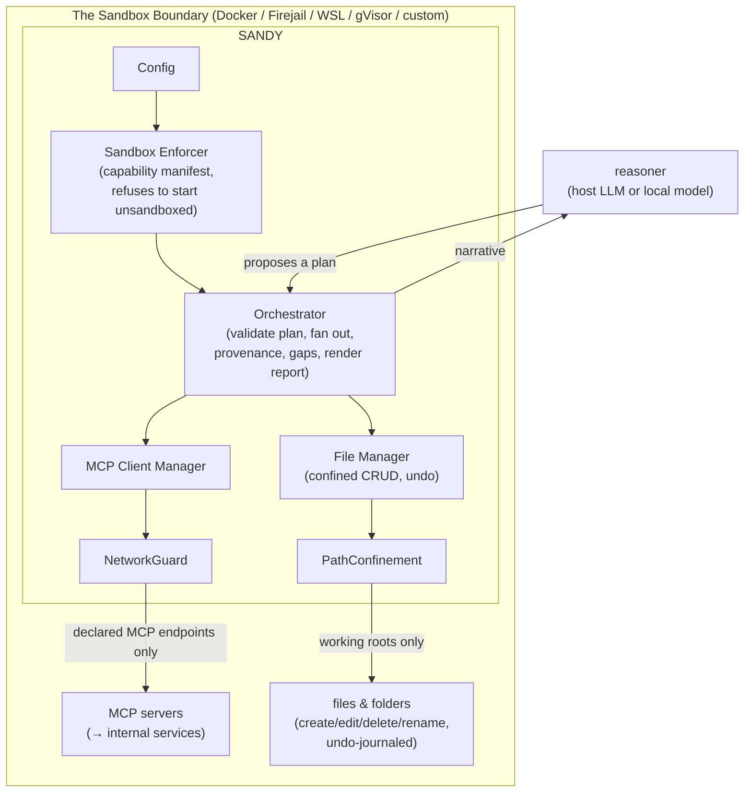

# Architecture

The mental model for what runs where, what the security boundary is, and how a request flows through Sandy. This is the document to read to understand *why* Sandy behaves the way it does.

## The one-sentence model

> A **reasoner** (your host LLM, or a small local model) proposes a plan of **MCP tool calls**. **Sandy** — a deterministic, auditable executor — validates that plan against a policy, runs only what is legal, inside a sandbox it proves it cannot leave, and turns the results into a **provenance-tracked report**.

The reasoner is swappable and never trusted. The executor is fixed, sandboxed, and audited.

## The two modes, one core

Everything below the reasoner is shared by both deployment modes. The only difference is who sits in the "reasoner" seat and who calls the executor.

### Plugin mode (Phase 1)

The **host LLM is the reasoner** — Claude Code or GitHub Codex. You install the Sandy plugin, which exposes the `sandy.*` tools over MCP. The host LLM decides what to gather and calls, for example, `sandy.report` with a goal and gather tasks. Sandy then executes deterministically behind the tools and returns the claims, gaps, and report path. The host LLM never touches the network or the filesystem directly — it can only go through Sandy, inside the sandbox.

- You (the human) are effectively the reasoner's controller: you ask the host LLM for something, it plans, it calls Sandy.
- Best when you're already inside a coding/assistant host and want **sandboxed, audited execution of internal data work**.

### Standalone mode (Phase 2)

A **small local model is the reasoner** — bundled, running as a subprocess on loopback **inside the same sandbox** (zero egress by construction). `sandy ask "<goal>"` runs the autonomous loop: the model **plans** (the plan is validated against the schema and the legal tool catalog — "the model proposes, the schema disposes"), Sandy **runs** it, the model optionally **narrates** a clearly-labeled summary, and a single provenance-tracked report is written. `sandy serve` runs this as a long-lived, **loopback-only** REST + SSE service.

- Best for **fully local, VPN-restricted, or air-gapped** environments where no frontier model can reach your internal data.

## The modules

| Module | Responsibility |
|--------|----------------|
| **Config** | Loads + validates `sandy.json` + `mcp-servers.json` **fail-closed**. Secrets are env-refs only. Cross-checks the write allowlist against the read allowlist. |
| **Sandbox Enforcer** | Detects the boundary, computes the **capability manifest** (fs roots, network destinations, subprocess needs), and reports reduced mode rather than failing opaquely. Owns the **NetworkGuard** egress choke point and **PathConfinement** (real-path, symlink-escape-refusing). |
| **MCP Client Manager** | Multi-server lifecycle (stdio / sse / http), startup validation, per-server **tool allowlists applied before wiring**, retries/backoff, terminal failures. All HTTP flows through the NetworkGuard. |
| **File Manager** | Confined CRUD with **confirmation gates**, an **undo journal** (byte-exact, incl. binaries + subtree snapshots), **dry-run**, ignore patterns, and format validation (text/csv/json/md + the binary report formats). |
| **Orchestrator** | Bounded fan-out of gather tasks, **provenance claims**, explicit **gaps**, the **report renderer** (5 formats), progress events, and the **write-back gate** (Q6). |
| **LLM Engine (seam)** | One interface for the reasoner's backend: `HostLlmEngine` (plugin), `LlamaCppEngine` (local subprocess), `RemoteEngine` (egress-guarded endpoint), `StubEngine` (tests). A lifecycle contract (`start`/`isReady`/`status`/`close`). |
| **Autonomous Loop** | The standalone plan→run→narrate loop, with bounded **multi-round planning** (issue #19). |
| **Audit** | Append-only, structured, **fail-closed** log (in-memory + JSONL), session transcript export. Every operation lands here. |
| **Local API** | The `sandy serve` loopback-only REST + SSE service with a bounded job store and a serial worker. |

## How a request flows (plugin `sandy.report`)

1. The host LLM calls `sandy.report` with `{ goal, gather, report }`.
2. The request body is validated against the **shared request schema** and the **legal tool catalog** (only the `server`/`tool` pairs the policy allows are legal — the allowlist is enforced *twice*: here, and again in the MCP manager before wiring).
3. The **Orchestrator** fans out the gather tasks with bounded concurrency.
4. Each call goes through the **MCP Client Manager** (allowlist + NetworkGuard). Successes become **claims** (text + a provenance source: server, tool, args sha256, timestamp). Failures become **gaps** (server-unavailable / call-failed / empty-result) — recorded, never smoothed over, never filled with invented data.
5. If a report is requested, the **report renderer** produces it in the configured format and the **File Manager** writes it inside the working roots (byte-exact for the binary formats).
6. Every step is **audited**. The result (claims, gaps, report path) returns to the host LLM.

The standalone loop is the same flow with the local model doing step 1 (planning) and an optional narrate step after step 5.

## What the reasoner can and cannot do

- **Can:** propose gather tasks (server, tool, args), request a report, and (in standalone) narrate.
- **Cannot:** touch the network or filesystem directly; call a server/tool not in the legal catalog; escape the sandbox; bypass the write-approval gate; or make an illegal plan "legal" by retrying (every attempt re-validates against the same gate).

This split — *untrusted reasoner, fixed sandboxed executor* — is the reason Sandy can run a small, fallible local model (or even a hostile one) without it becoming a risk: the blast radius of a bad plan is a few extra *legal* read calls, never an unvalidated request, never a write, never an escape.
